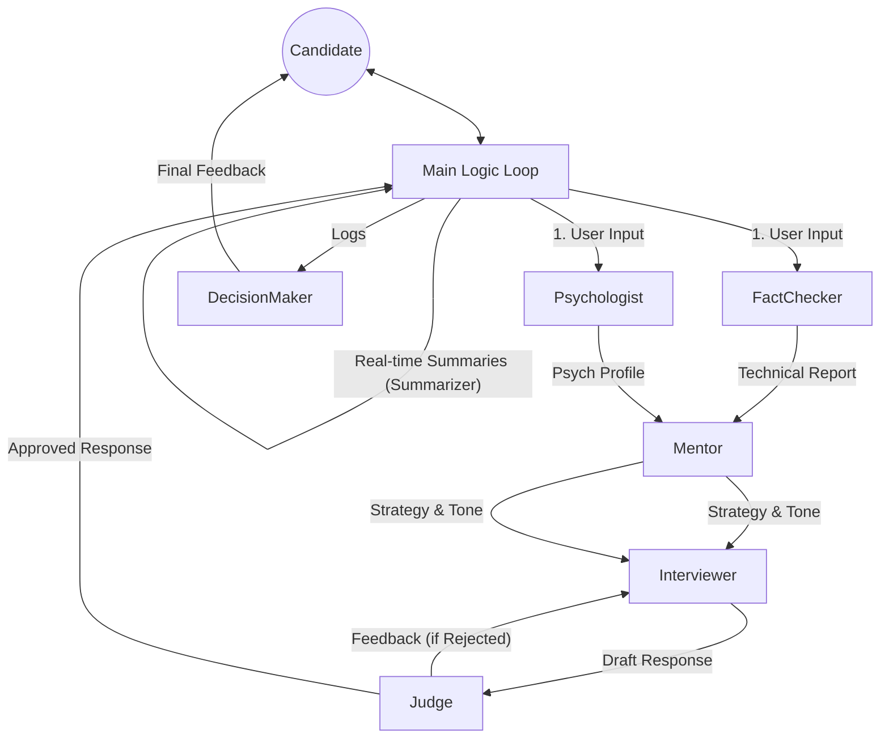

# Multi-Agent Interview Coach

## 🚀 Быстрый Старт

### 1. Установка зависимостей
```bash
pip install -r requirements.txt
```

### 2. Настройка окружения
Создайте файл `.env` в корне проекта и добавьте ваш API ключ (а также название и url в моем случае - локальная модель):
```env
OPENAI_API_KEY=sk-...
```

### 3. Инициализация Базы Знаний
Перед первым запуском необходимо загрузить факты в векторную базу данных:
```bash
python src/knowledge_base.py
```

### 4. Запуск Интервью
```bash
python src/main.py
```

### 5. А чтобы запустить финальное тестирование с данными из файла
```bash
python src/final_test_runner.py
```

---

## Обзор Архитектуры

Этот проект представляет собой систему из **5 специализированных AI-агентов**, которые проводят техническое интервью, имитируя поведение реального рекрутера и технического лида. 

Главная особенность системы — **разделение ответственности**. Вместо одного "супер-промпта", который пытается делать всё сразу, система разбита на узкоспециализированные роли, которые общаются между собой «в кулуарах» (скрыто от пользователя), прежде чем выдать ответ.

---

## Агенты (Всего: 7)

В системе реализованы следующие агенты (размещены в `agents.py`):

1. **FactCheckerAgent (Проверяющий факты)**
   - **Роль**: Технический аудитор.
   - **Задача**: Проверяет утверждения кандидата на истинность, используя локальную базу знаний (`KnowledgeBase`).
   - **Выход**: "Вердикт: Правда/Ложь" с доказательствами.

2. **PsychologistAgent (Психолог)**
   - **Роль**: Аналитик Soft Skills.
   - **Задача**: Оценивает уверенность, честность, стрессоустойчивость и стиль общения кандидата.
   - **Выход**: Психологический портрет текущего ответа.

3. **MentorAgent (Ментор/Стратег)**
   - **Роль**: "Мозг" операции. Не общается с кандидатом напрямую.
   - **Задача**: Получает отчеты от Фак-чекера и Психолога, анализирует историю диалога и решает, куда вести интервью дальше (углубить тему, сменить тему, упростить вопрос).
   - **Выход**: Инструкция для Интервьюера (Что спросить) и Тон (Как спросить).

4. **InterviewerAgent (Интервьюер)**
   - **Роль**: "Голос" системы.
   - **Задача**: Генерирует финальный ответ пользователю (на русском языке), строго следуя инструкциям Ментора.
   - **Выход**: Текст вопроса или реплики для кандидата.

   - **Выход**: Текст вопроса или реплики для кандидата.

5. **JudgeAgent (Ревизор/Судья)**
   - **Роль**: LLM-as-a-Judge.
   - **Задача**: Проверяет сгенерированный Интервьюером ответ *до* его отправки кандидату. Оценивает безопасность и соответствие тону/инструкции.
   - **Выход**: Вердикт (Approved/Rejected) и обратная связь для перегенерации.

6. **SummarizerAgent (Архивариус)**
   - **Роль**: Управление памятью (Memory Management).
   - **Задача**: Сжимает старую историю диалога (если более 6 ходов) в краткое резюме, чтобы экономить контекстное окно, но сохранять суть беседы.
   - **Выход**: Сжатое саммари диалога.

7. **DecisionMakerAgent (Принимающий решения)**
   - **Роль**: Финальный судья.
   - **Задача**: Вступает в игру только после завершения интервью. Анализирует **весь** лог общения и выносит вердикт.
   - **Выход**: Структурированный отчет (Grade, Hiring Recommendation, Score Breakdown).

---

## Схема Взаимодействия



## Технический Стек
* **Язык**: Python
* **LLM**: Подключение через `LLMClient` (OpenAI API совместимый интерфейс, по умолчанию Qwen 2.5).
* **Framework**: **LangChain** (LCEL) для оркестрации агентов и управления промптами.
* **Vector DB**: **ChromaDB** (Local) для семантического поиска фактов.
* **Embeddings**: `sentence-transformers/all-MiniLM-L6-v2` (через HuggingFace).
* **RAG**: Реализован полноценный Retrieval-Augmented Generation: вопрос -> поиск векторов -> контекст для агента.
* **Logging**: Структурированное логирование всех "мыслей" агентов в JSON/TXT.
